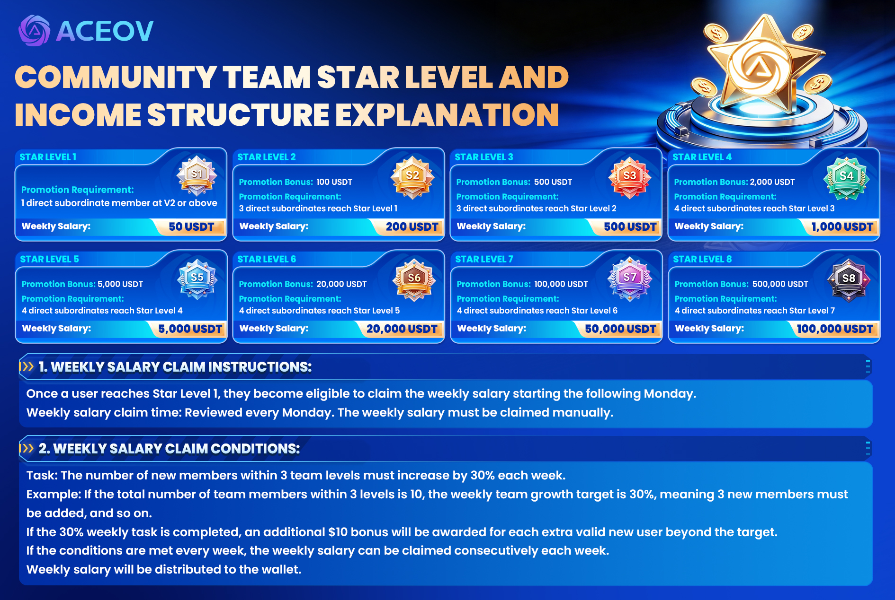

# ACEOV Community Star-Level Monthly Salary

<figure><figcaption></figcaption></figure>

### <mark style="color:blue;">🌟</mark> <mark style="color:blue;">**Star Level Advancement Reward Plan Overview**</mark>

To encourage team growth and improve member activity, the company has launched the **Star Level Advancement Reward Plan**. When users reach the corresponding star level, they can not only receive advancement rewards but also enjoy weekly salary rewards .

Except for Star Level 1, advancement from Star Level 2 and above is no longer based only on the number of direct referrals. Instead, it evaluates the development ability and team-building performance of your **direct A-level members** .

This means:\
You not only need to invite members to join, but also help your direct members grow to the required star levels in order to advance further .

***

### <mark style="color:$primary;">⭐ Star Level Requirements</mark>

#### 🌟 Star Level 1 (Weekly Salary: 50 USDT)

Requirements:

* At least **1 direct A-level member reaches Level 2 or above**

***

#### 🌟 Star Level 2 (Weekly Salary: 200 USDT)

Advancement reward: **100 USDT** (when upgrading from Star 1 to Star 2 )\
Requirements:

* At least **3 direct A-level members reach Star Level 1**\
  (i.e., at least 3 of your directly referred members must successfully reach Star Level 1)

***

#### 🌟 Star Level 3 (Weekly Salary: 500 USDT)

Advancement reward: **500 USDT** (when upgrading from Star 2 to Star 3)\
Requirements:

* At least **3 direct A-level members reach Star Level 2**

***

#### 🌟 Star Level 4 (Weekly Salary: 1000 USDT)

Advancement reward: **2000 USDT** (when upgrading from Star 3 to Star 4)\
Requirements:

* At least **4 direct A-level members reach Star Level 3**

***

#### 🌟 Star Level 5 (Weekly Salary: 5000 USDT)

Advancement reward: **5000 USDT** (when upgrading from Star 4 to Star 5)\
Requirements:

* At least **4 direct A-level members reach Star Level 4**

***

#### 🌟 Star Level 6 and above

Same structure applies

***

### <mark style="color:$primary;">💰 Weekly Salary Collection Rules</mark>

#### 📌 1. Eligibility for Weekly Salary

After successfully reaching **Star Level 1 or above**, users cannot start collecting weekly salary immediately.\
Eligibility begins from the **following Monday** .

#### 📌 Weekly Review & Payment Time

* Reviews are conducted every **Monday**
* Weekly salary must be **reviewed and approved by a manager**
* After approval, funds will be sent to your **crypto wallet**

***

### 📈 2. Weekly Salary Conditions

To continuously receive weekly salary, you must complete team growth targets:

#### 👥 Team Growth Requirement

Members within your **3-level team (A/B/C levels)** must achieve a **30% weekly increase in active users**

📊 **Example:**

If your current 3-level team has **10 members**:

* 30% growth = **3 new members**
* You must add **3 new valid members per week**

If your team has **20 members**:

* 30% growth = **6 new members**
* You must add **6 new valid members per week**

And so on

***

### 🎁 3. Extra Bonus Rewards

If you exceed the 30% weekly growth target:

* For every **extra valid new member**, you earn **10 USDT extra bonus**

#### Example:

If the target is 3 new members but you add 6:

* Base requirement met → weekly salary granted
* Extra members: 3
* Bonus: **3 × 10 = 30 USDT**

***

### 🔁 4. Continuous Reward Mechanism

As long as the team continues to meet the weekly growth requirements:

✅ Weekly salary can be collected continuously\
✅ Rewards accumulate over time\
✅ All payments are issued to your personal wallet

***

### <mark style="color:$primary;">📌 Key Summary</mark>

* Higher star level = higher weekly salary
* After promotion, weekly salary starts from the next Monday
* Must achieve **30% weekly growth within 3-level team**
* Extra valid users = extra bonuses
* Salary must be manually claimed after approval
* Faster team growth = higher earnings
