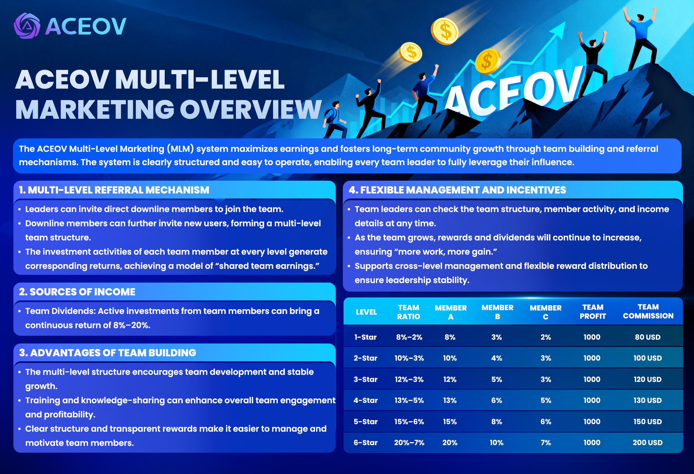

# ACEOV Multi-Level Marketing (MLM) Explanation

<figure><figcaption></figcaption></figure>

The **ACEOV Multi-Level Marketing system (MLM)** maximizes earnings and promotes long-term community growth through **team building and referral mechanisms**. The system is clear, easy to operate, and allows every team leader to fully leverage their influence.

***

### <mark style="color:purple;">🔗 Multi-Level Referral Mechanism</mark>&#x20;

* Leaders can **invite direct members** to join their team.
* Invited members can continue to recruit new users, forming a **multi-level team structure**.
* Each team member’s investment generates **corresponding earnings**, achieving “shared team profits.”

***

### <mark style="color:purple;">💰 Sources of Earnings</mark>&#x20;

* **Team Dividends:** Active investments by team members generate **ongoing earnings of 8%–20%**.

***

### <mark style="color:purple;">🌟 Team Building Advantages</mark>&#x20;

* The multi-level structure **encourages team development and stable growth**.
* Team activity and earnings can be enhanced through **training and experience sharing**.
* **Clear structure and transparent rewards** make it easy to manage and incentivize team members.

***

### <mark style="color:purple;">⚙️ Flexible Management & Incentives</mark>&#x20;

* Leaders can view **team structure, member activity, and earnings details** at any time.
* As the team grows, rewards and dividends **increase sustainably**, creating a “more effort, more gain” effect.
* Supports **cross-level management** and flexible reward distribution to ensure stable leadership incentives.

***

### <mark style="color:purple;">**📊 Team Structure & Earnings Table**</mark>&#x20;

<table><thead><tr><th width="85" align="center">Level</th><th width="96" align="center">Team Ratio</th><th width="98" align="center">A-Level Members</th><th width="90" align="center">B-Level Members</th><th width="111" align="center">C-Level Members</th><th width="134" align="center">Team Profit 💰</th><th align="center">Team Commission 💵</th></tr></thead><tbody><tr><td align="center">1</td><td align="center">8%–2%</td><td align="center">8%</td><td align="center">3%</td><td align="center">2%</td><td align="center">1000</td><td align="center">80 USD</td></tr><tr><td align="center">2</td><td align="center">10%–3%</td><td align="center">10%</td><td align="center">4%</td><td align="center">3%</td><td align="center">1000</td><td align="center">100 USD</td></tr><tr><td align="center">3</td><td align="center">12%–3%</td><td align="center">12%</td><td align="center">5%</td><td align="center">3%</td><td align="center">1000</td><td align="center">120 USD</td></tr><tr><td align="center">4</td><td align="center">13%–5%</td><td align="center">13%</td><td align="center">6%</td><td align="center">5%</td><td align="center">1000</td><td align="center">130 USD</td></tr><tr><td align="center">5</td><td align="center">15%–6%</td><td align="center">15%</td><td align="center">8%</td><td align="center">6%</td><td align="center">1000</td><td align="center">150 USD</td></tr><tr><td align="center">6</td><td align="center">20%–7%</td><td align="center">20%</td><td align="center">10%</td><td align="center">7%</td><td align="center">1000</td><td align="center">200 USD</td></tr></tbody></table>
