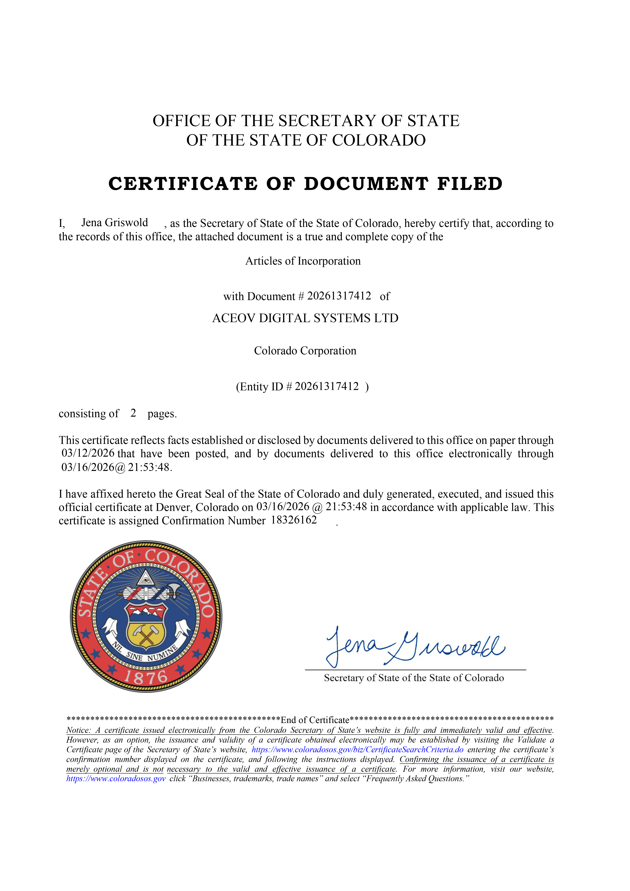
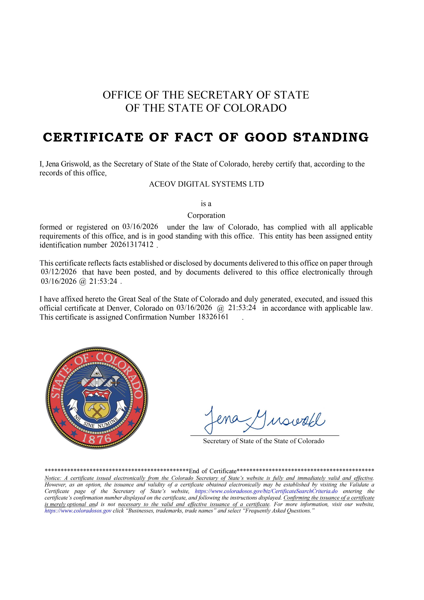
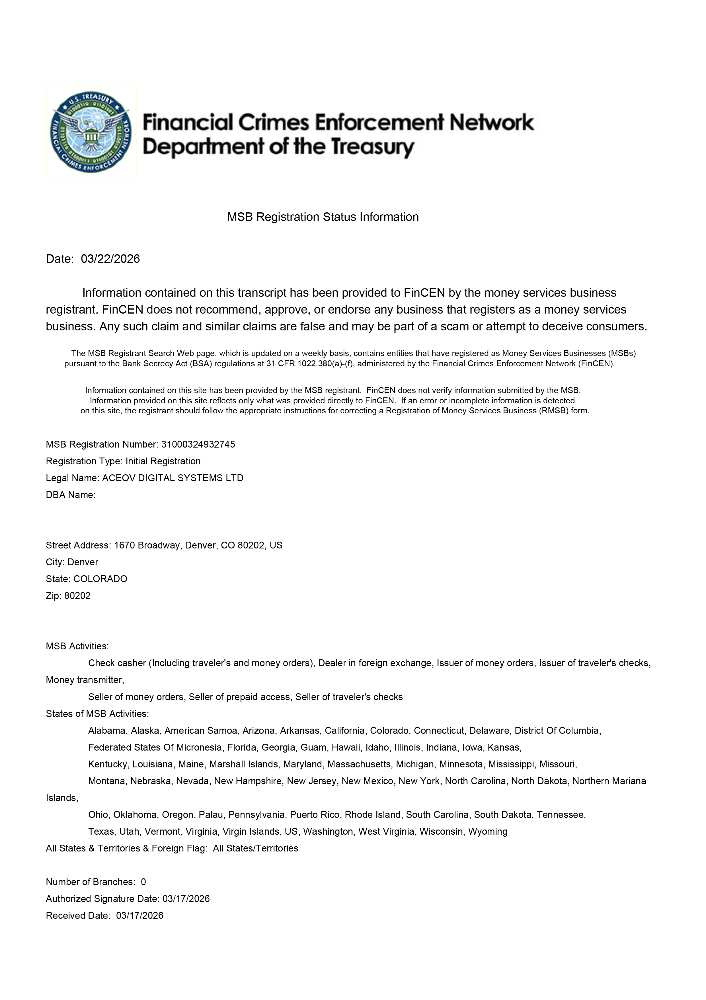

# ACEOV Certificate Display



<figure><figcaption></figcaption></figure>

***



<figure><figcaption></figcaption></figure>

***



<figure><figcaption></figcaption></figure>

#### 🔍 **How to Check MSB Information**

<https://www.fincen.gov/msb-state-selector>

**Search by Company Name**

1. Scroll down and find **\[LEGAL NAME]**, then enter the company name.
2. Company full name: **ACEOV DIGITAL SYSTEMS LTD**
3. A new page will appear, showing the company’s detailed information.

***

**Search by MSB Code**

1. Scroll down and find **\[MSB REGISTRATION NUMBER/DCN]**, then enter the code.
2. **31000324932745**
3. A new page will appear, showing the company’s detailed information.

*(If you see a blank page, scroll up.)*
