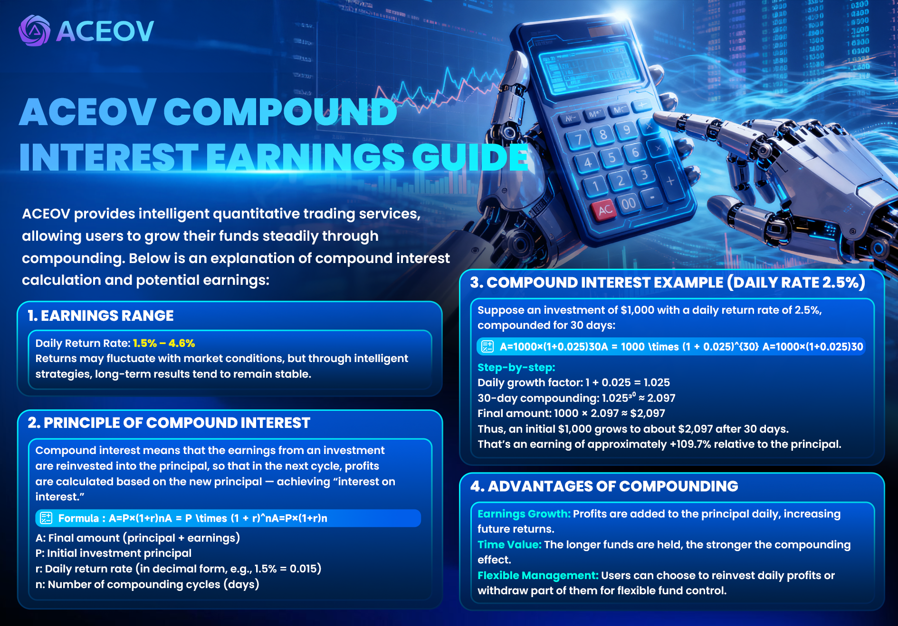

# ACEOV Compound Interest Earnings Guide

<figure><figcaption></figcaption></figure>




### <mark style="color:blue;">📊</mark> <mark style="color:blue;"></mark><mark style="color:blue;">**Earnings Range**</mark>

* **Daily Return Rate:** **1.5% – 4.6%**
* Returns may fluctuate with market conditions, but **long-term earnings tend to stabilize** through intelligent strategies.
  



### <mark style="color:blue;">🔄</mark><mark style="color:blue;">**Principle of Compound Interest**</mark>

Compound interest means that investment earnings are **reinvested into the principal**, and the next period’s earnings are calculated based on the new principal, achieving “interest on interest.”

<mark style="color:purple;">**Formula:**</mark>

A=P×(1+r)nA = P \times (1 + r)^nA=P×(1+r)n

Where:

* **A**: Total principal + interest
* **P**: Initial investment
* **r**: Daily return rate (in decimal, e.g., 1.5% = 0.015)
* **n**: Number of compounding periods (days)
  



### <mark style="color:blue;">**📈 Compound Interest Example (Daily Return Rate 2.5%)**</mark>&#x20;

Assume an investment of **$1000** with a daily return rate of **2.5%**, compounded for **30 days**:

A=1000×(1+0.025)30A = 1000 \times (1 + 0.025)^{30}A=1000×(1+0.025)30

**Step-by-step calculation:**

* Daily growth factor: 1 + 0.025 = 1.025
* 30-day compound factor: 1.025³⁰ ≈ 2.097
* Final principal + interest: 1000 × 2.097 ≈ **$2097**

The initial $1000 grows to approximately $2097 in 30 days,\
**equivalent to a gain of \~109.7% of the principal**.




### <mark style="color:blue;">**🌟 Advantages of Compound Interest**</mark>&#x20;

* **Earnings Accumulation:** Daily profits are added to the principal, increasing future returns.
* **Time Value:** The longer the investment period, the more significant the compound effect.
* **Flexible Operation:** Users can choose to reinvest daily or withdraw part of the earnings, allowing flexible fund management.
  
  
