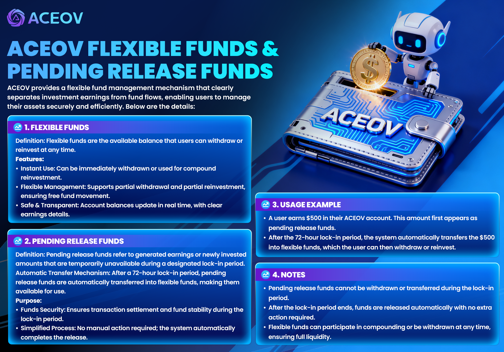

# 🇺🇿 ACEOV Flexible Funds & Pending Funds Explanation

<figure><figcaption></figcaption></figure>

ACEOV provides a flexible fund management mechanism, clearly distinguishing between investment earnings and fund liquidity, making it easier for users to manage assets safely and efficiently.

***



### <mark style="color:blue;">**💳**</mark> <mark style="color:blue;">Flexible Funds</mark>

**Definition:** Flexible funds are the available balance that users can withdraw or reinvest at any time.

<mark style="color:purple;">**Features**</mark>**:**

* **Instant Availability:** Funds can be withdrawn immediately or used for compound investment.
* **Flexible Management:** Supports partial withdrawals and partial reinvestments, allowing freer fund flow.
* **Safe and Transparent:** Account balances are updated in real-time, and earnings records are clearly traceable.



### <mark style="color:blue;">**⏳ Pending Funds**</mark>

**Definition:** Pending funds refer to earnings or new investment amounts that are temporarily unavailable for use due to a lock-in period.

**Automatic Transfer Mechanism 🔁:**\
Funds will be automatically transferred to the flexible funds account by the system after the 72-hour lock-in period, at which point they can be freely used.

**Purpose:**

* **Ensure Security:** The lock-in period helps ensure transaction settlement and fund stability.
* **Simplify Operations:** Funds are automatically released by the system, requiring no manual action.



### <mark style="color:blue;">📊 Usage Example</mark>

A user earns $500 in their ACEOV account:

* Initially, it is displayed as "Pending Funds."
* After the 72-hour lock-in period, the system automatically transfers the funds to "Flexible Funds,"\
  allowing the user to choose either withdrawal or reinvestment.



### <mark style="color:blue;">👥</mark> <mark style="color:blue;">**Team Funds**</mark>

Team profits and growth center rewards will automatically enter the "Team Funds" account after the 72-hour lock-in period.\
These funds **cannot be transferred to Flexible Funds** and can only be used for **withdrawals**.



### **⚠️** <mark style="color:blue;">Notes</mark>

* Pending funds cannot be withdrawn or transferred during the lock-in period.
* After the lock-in period, funds are automatically released by the system with no additional action required.
* Flexible funds can be used for compound investments or withdrawals at any time, ensuring high liquidity.


