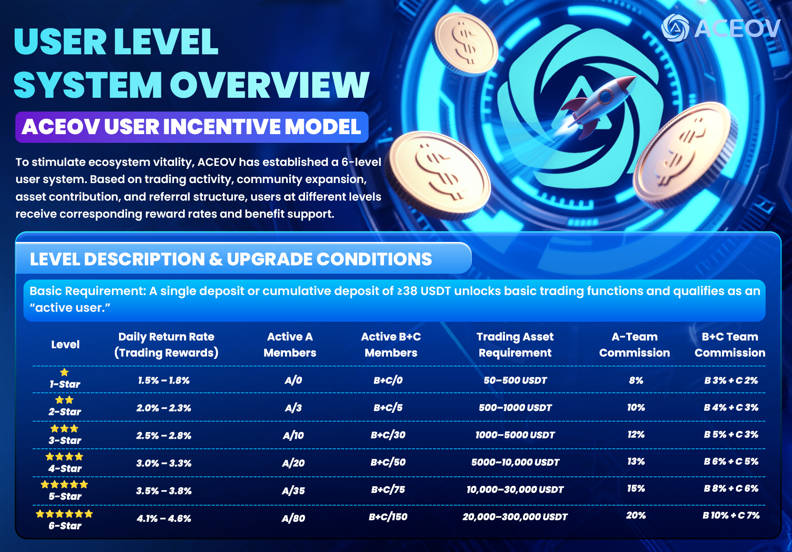

# 💾 Overview of Earnings Mechanism

<figure><figcaption></figcaption></figure>

### <mark style="color:purple;">**🌟 User Level System Overview (ACEOV User Incentive Model)**</mark>&#x20;

To stimulate ecosystem activity, ACEOV has established a **three-tier user system**. Rewards and benefits are granted based on **trading activity, community expansion, asset contribution, and referral structure**.

***

### <mark style="color:purple;">✅</mark> <mark style="color:purple;"></mark><mark style="color:purple;">**Level Description & Upgrade Conditions**</mark>

* **Basic Requirement:** Single or cumulative deposit ≥ 30 USDT to unlock basic trading functions and become an **“active user”**.
* When promoted to each new level, the team size will be recalculated. The number of members accumulated from previous levels will no longer be carried over, and the requirements must be met again according to the criteria of the current level.

<table><thead><tr><th width="86" align="center">Level</th><th align="center">Daily Return Rate (Trading Reward) 📈</th><th width="86" align="center">Active Community Members 👥</th><th width="97" align="center">Active B+C Area Members 👥</th><th width="149" align="center">Trading Asset Requirement 💰</th><th width="88" align="center">Team A Commission 🔹</th><th align="center">Team B+C Commission 🔹</th></tr></thead><tbody><tr><td align="center">1</td><td align="center">1.5%–1.8%</td><td align="center">A/0</td><td align="center">B/C+0</td><td align="center">30–500 USDT</td><td align="center">8%</td><td align="center">B3% + C2%</td></tr><tr><td align="center">2</td><td align="center">2.0%–2.3%</td><td align="center">A/3</td><td align="center">B/C+5</td><td align="center">500–1000 USDT</td><td align="center">10%</td><td align="center">B4% + C3%</td></tr><tr><td align="center">3</td><td align="center">2.5%–2.8%</td><td align="center">A/10</td><td align="center">B/C+30</td><td align="center">1000–5000 USDT</td><td align="center">12%</td><td align="center">B5% + C3%</td></tr><tr><td align="center">4</td><td align="center">3.0%–3.3%</td><td align="center">A/20</td><td align="center">B/C+50</td><td align="center">5000–10000 USDT</td><td align="center">13%</td><td align="center">B6% + C5%</td></tr><tr><td align="center">5</td><td align="center">3.5%–3.8%</td><td align="center">A/35</td><td align="center">B/C+75</td><td align="center">10000–30000 USDT</td><td align="center">15%</td><td align="center">B8% + C6%</td></tr><tr><td align="center">6</td><td align="center">4.1%–4.6%</td><td align="center">A/80</td><td align="center">B/C+150</td><td align="center">20000–300000 USDT</td><td align="center">20%</td><td align="center">B10% + C7%</td></tr></tbody></table>
