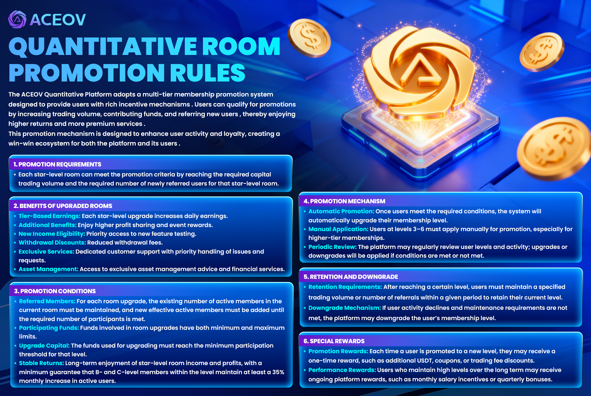

# Quantitative Room Promotion Rules

<figure><figcaption></figcaption></figure>

The **ACEOV Quantitative Platform** adopts a multi-tier membership promotion system designed to provide users with rich incentive mechanisms . Users can qualify for promotions by increasing trading volume, contributing funds, and referring new users , thereby enjoying higher returns and more premium services .\
This promotion mechanism is designed to enhance user activity and loyalty, creating a **win-win ecosystem** for both the platform and its users .

***

### <mark style="color:purple;">⭐ 1. Promotion Requirements</mark>

👥 Each star-level room can be upgraded by reaching the required **fund trading volume** and meeting the **number of newly referred users** for that star-level room .

***

### <mark style="color:purple;">🎁 2. Benefits of Upgraded Rooms</mark>

* 📊 **Level-Based Earnings** : Each star-level upgrade increases daily earnings.
* 💎 **Additional Benefits** : Enjoy higher profit shares and event rewards.
* 🧪 **New Income Eligibility** : Priority access to new feature testing.
* 💸 **Withdrawal Discounts** : Reduced withdrawal handling fees.
* 🎧 **Exclusive Services** : Dedicated customer support with priority issue handling.
* 📈 **Asset Management** : Exclusive asset management advice and financial services.

***

### <mark style="color:purple;">🧩 3. Promotion Conditions</mark>

* 👤 **Referred Members** : For each room upgrade, the original number of active members must be maintained, while adding new effective active members until the required room capacity is met.
* 💵 **Participating Funds** : Each promotion level has both minimum and maximum capital limits.
* 🔒 **Upgrade Capital Requirement** : The funds involved must meet the minimum capital threshold for that level.
* 🔁 **Stable Earnings** : To continuously enjoy star-level room benefits, B + C level members within the level must ensure at least **35% monthly active user growth**.

***

### <mark style="color:purple;">⚙️ 4. Promotion Mechanism</mark>

* 🤖 **Automatic Promotion** : Once conditions are met, the system will automatically upgrade the user’s membership level.
* ✍️ **Manual Application** : Level 3–6 users must apply manually for promotion, especially higher-tier members.
* 🔍 **Periodic Review** : The platform may regularly review user levels and activity; upgrades or downgrades will be applied based on eligibility.

***

### <mark style="color:purple;">⬆️⬇️ 5. Level Retention & Downgrade</mark>

* 🛡️ **Retention Requirements** : After reaching a certain level, users must maintain required trading volume or referral numbers to retain their level.
* ⚠️ **Downgrade Mechanism** : If user activity declines and fails to meet retention standards, the platform may downgrade the membership level.

***

### <mark style="color:purple;">🎉 6. Special Rewards</mark>

* 🎊 **Promotion Rewards** : Upon each level upgrade, users may receive one-time rewards such as extra **USDT**, vouchers, or trading fee discounts.
* 🏆 **Continuous Performance Rewards** : Users who maintain high levels long-term may receive ongoing incentives, such as **monthly salary rewards** or **quarterly bonuses**.
